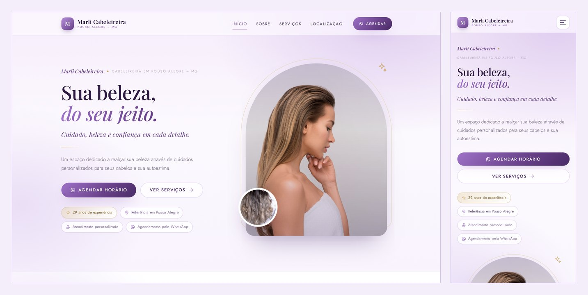

# Marli Cabeleireira — Landing Page

Landing page de conversão para o salão **Marli Cabeleireira**, em Pouso Alegre – MG.
Construída em HTML, CSS e JavaScript puros, sem frameworks, sem dependências e sem etapa de build.



🔗 **[marli-cabeleireira.netlify.app](https://marli-cabeleireira.netlify.app)**

---

## Sobre o projeto

O salão não tinha presença digital: os agendamentos aconteciam só por indicação e
WhatsApp. A página foi feita com um objetivo único — **transformar a visita em um
agendamento pelo WhatsApp** — e com um segundo objetivo de médio prazo: aparecer
nas buscas locais por "cabeleireira em Pouso Alegre".

Todo o conteúdo (serviços, preços, marcas, fotos do ambiente) veio da própria
profissional. Nada foi inventado.

## Funcionalidades

- **Agendamento por WhatsApp** — 28 pontos de conversão ao longo da página, com
  mensagem pré-preenchida. Os botões dos cards enviam o nome do serviço junto,
  reduzindo o atrito da primeira mensagem.
- **Tabela de 16 serviços** organizada em 4 categorias, mais um pacote para eventos.
- **Botão flutuante** de WhatsApp que aparece após a primeira rolagem.
- **Menu fixo** com scrollspy e menu hambúrguer no celular.
- **Galeria** com fotos reais do salão e imagens ilustrativas dos serviços.
- **Mapa** do Google incorporado, com fallback quando não carrega.
- **Animações de entrada** discretas, desligadas automaticamente para quem usa
  `prefers-reduced-motion`.

## Decisões técnicas

**Por que sem framework.** O site é uma página estática que precisa carregar rápido
em rede móvel e ser editável por quem não programa. React ou Next.js só acrescentariam
build, dependências e superfície de manutenção. O resultado são **3 arquivos de código**
(HTML, CSS, JS) e nenhuma dependência para atualizar.

**Responsividade sem depender de recorte.** Testado de 280px (Galaxy Fold fechado) a
2560px. Os elementos decorativos que ultrapassam as fotos têm recuos reduzidos no
celular, porque `overflow-x: hidden` no `body` é ignorado pelo Safari do iOS em vários
casos — a rolagem lateral foi resolvida na origem, não mascarada.

**Tipografia fluida.** Títulos em `clamp()` com interpolação linear, para crescerem de
forma contínua em vez de saltar nos pontos de virada.

**Alvos de toque.** Todos os elementos interativos têm no mínimo 44px de altura.

**SEO local.** Dados estruturados `HairSalon` (schema.org) com endereço, telefone,
faixa de preço e catálogo de serviços; meta tags Open Graph; headings hierárquicos;
`alt` em todas as imagens.

**Acessibilidade.** Navegação por teclado, foco visível, link "pular para o conteúdo",
`aria-expanded` no menu e contraste conferido.

## Estrutura

```
.
├── index.html                 # toda a página
├── robots.txt / sitemap.xml   # SEO
└── assets/
    ├── css/styles.css         # design tokens, componentes, responsividade
    ├── js/main.js             # menu, animações, links do WhatsApp
    └── img/                   # fotos, ícones e logos das marcas
```

## Como rodar

Não precisa de servidor nem instalação — basta abrir o `index.html` no navegador.

Para servir localmente (recomendado, para o mapa e os caminhos relativos):

```bash
python -m http.server 8000
```

Depois acesse `http://localhost:8000`.

## Personalização

**Número e mensagem do WhatsApp:** edite apenas o bloco `CONFIG` no topo de
`assets/js/main.js`. Todos os botões são montados a partir dele.

```js
var CONFIG = {
  whatsapp: '5535998323042',
  mensagem: 'Olá, Marli! Gostaria de agendar um horário...',
  mensagemServico: 'Olá, Marli! Gostaria de agendar um horário para {servico}...'
};
```

**Cores:** todas no bloco `:root` do topo de `assets/css/styles.css`.

**Preços e serviços:** cada serviço é um `<article class="service">` em `index.html`.
Ao alterar um valor, atualize também o bloco `application/ld+json` do `<head>`.

## Créditos

- Fotos do ambiente: acervo do salão.
- Demais imagens: [Unsplash](https://unsplash.com) (licença de uso livre).
- Tipografia: [Playfair Display](https://fonts.google.com/specimen/Playfair+Display)
  e [Jost](https://fonts.google.com/specimen/Jost), via Google Fonts.
- Logos das marcas de produtos são marcas registradas de seus respectivos
  fabricantes, exibidas apenas para indicar os produtos utilizados no salão.

## Licença

O código está sob licença MIT. As imagens, logos e o conteúdo do salão
(textos, preços, marca) não estão cobertos por ela.
